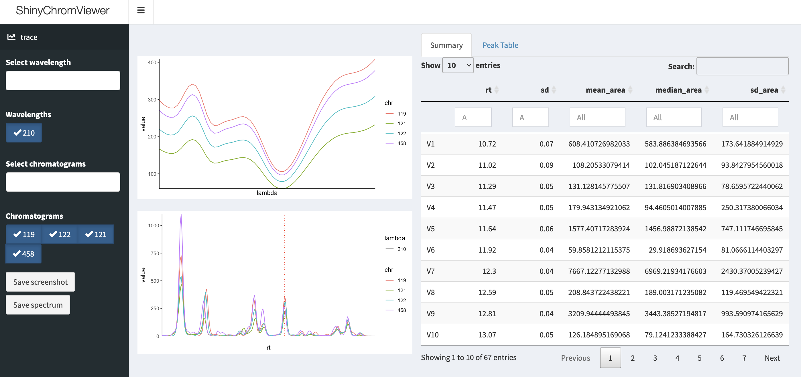

# ShinyChromViewer

<!-- badges: start -->
[](https://ethanbass.r-universe.dev)
<!-- badges: end -->

## Overview

ShinyChromViewer is an Shiny gadget for interactive viewing and exploration of 3D chromatographic data (e.g. from HPLC-DAD). It is mainly meant to be used in conjunction with [chromatographR](https://ethanbass.github.io/chromatographR) as an add-on.

## Installation

ShinyChromViewer can be installed from GitHub as follows:

```
install.packages("devtools")
devtools::install_github("https://github.com/ethanbass/ShinyChromViewer/")
```

Or install directly from my R Universe repo:

```
install.packages("ShinyChromViewer", repos="https://ethanbass.r-universe.dev/", type="source")
```

## Usage

To run ShinyChromConverter you must provide a list of chromatograms in `matrix` format. In addition, you can provide a `peak_table` object produced by [chromatographR](https://ethanbass.github.io/chromatographR). The script below loads the example data from chromatographR and launches the `chrom_viewer`. 

```
library(chromatographR)
library(ShinyChromViewer)
data(Sa_warp)
data(pk_tab)
chrom_viewer(pk_tab)
```

To view spectra, click on the trace plot (*lower left panel*) or the peak table (*right panel*).

</img>
